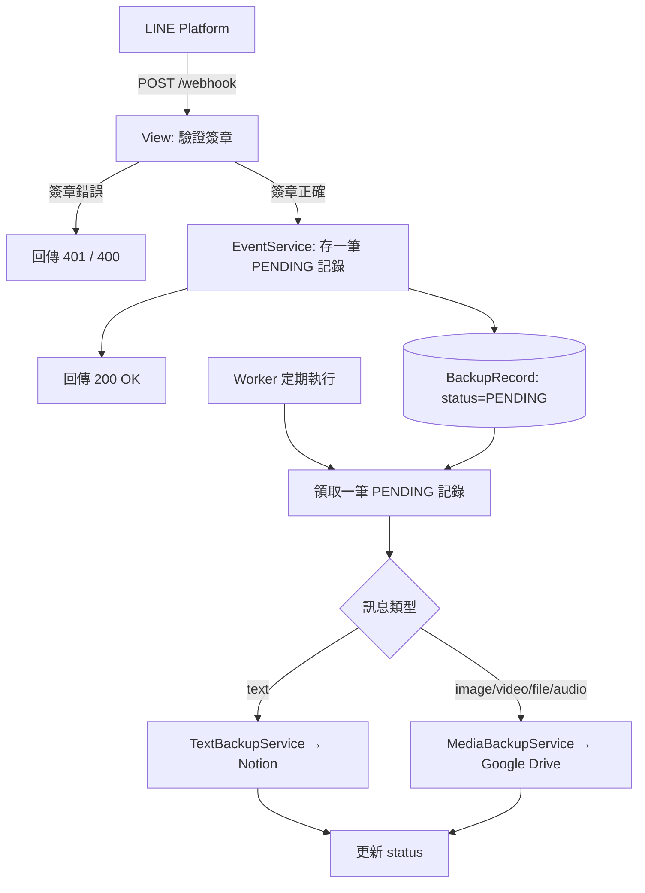

# Architecture

這份文件說明系統怎麼分層、資料怎麼流動、程式要放在哪個資料夾。範圍對應 [PRD.md](../PRD.md) 的 MVP：4 個 Use Case、10 個 Functional Requirement、4 種狀態（`PENDING / SUCCESS / FAILED / SKIPPED`）。

---

## 整體架構

系統分成兩條路徑：先「接收並存檔」，再「背景處理」。



### 設計原理

LINE 期待 Webhook 很快回應，但上傳一部影片到 Google Drive 可能要好幾秒。如果全部塞在同一個請求裡處理，Webhook 會逾時。所以拆成「先存檔快速回應」+「背景慢慢處理」兩步，這是整份文件裡最重要的一個決定。

---

## Module

| Module | 做什麼 |
|---|---|
| `views.py` | 接 `POST /webhook`，驗證後交給 Service，回傳結果。 |
| `services/` | 所有商業邏輯：收事件、判斷訊息類型、備份到 Notion / Drive、重試。 |
| `clients/` | 包住外部 API（LINE / Notion / Google Drive）的呼叫細節。 |
| `repository.py` | 唯一可以直接操作資料庫的地方。 |
| `models.py` | 資料表定義（`RawEvent`、`BackupRecord`）。 |
| `errors.py` | 共用的錯誤分類（`TransientError` / `PermanentError` / `SkipError`）。 |
| `utils/` | 沒有依賴的小工具函式（驗證簽章、判斷檔案類型、切字串、JSON log）。 |
| `management/commands/` | 背景 worker 的進入點。 |

`errors.py` 存在的理由：Retry 流程只需要知道「這個錯誤重試有沒有意義」。
由 Client 層把各家 SDK 的例外（`notion_client.APIResponseError`、
`googleapiclient.errors.HttpError`、`requests.Timeout`…）翻譯成這三種，
Service 與 RetryService 就不用認得任何外部 SDK 的錯誤型別。


每一層只做一件事：View 只管 HTTP、Service 管邏輯、Repository 管資料庫、Client 管外部 API。這樣測試 Service 時可以直接假造一個 Client，不用真的呼叫 Notion / Google Drive。

---

## 依賴規則 (Dependency)

```
views → services → repository → models
              ↘ clients
utils（誰都可以用，但不依賴任何人）
```

上面的層只能呼叫下面的層，不可以跳過、也不可以反過來呼叫。

---

## Data Flow

### Flow 1：收到訊息 (Ingestion) — 對應 UC-1 ~ UC-4

| 步驟 | 動作 |
|---|---|
| 1 | LINE 送出 Webhook |
| 2 | View 驗證 `X-Line-Signature`（不合法 → 401/400，不存任何資料） |
| 3 | `EventService` 把整包原始資料存進 `RawEvent`（稽核用） |
| 4 | 每個事件存一筆 `BackupRecord`，狀態設為 `PENDING` |
| 5 | 立刻回傳 `200 OK` |

> 這一段不能呼叫 Notion 或 Google Drive API — 一定要快。

### Flow 2：背景處理 (Processing) — 對應 UC-1、UC-2

| 步驟 | 動作 |
|---|---|
| 1 | 排程觸發 `process_pending_backups` |
| 2 | 領取一筆 `PENDING` 記錄（見下方「領取機制」） |
| 3 | 依 `message_type` 判斷走 Notion 還是 Google Drive |
| 4 | 呼叫對應 Client 完成備份 |
| 5 | 更新記錄狀態為 `SUCCESS` / `FAILED` / `SKIPPED` |

**領取機制**

`repository.claim_next_pending()` 在一個交易裡用 PostgreSQL 的
`SELECT ... FOR UPDATE SKIP LOCKED` 鎖住最舊的一筆 `PENDING`，再把
`attempts` 加一並提交。兩個 worker 同時查詢時，第二個會直接跳過被鎖住的列、
改挑下一筆，不會卡住等待——跟防重複一樣，交給資料庫判斷，不是程式先查再寫。

這樣做不用多一個 `PROCESSING` 狀態（維持 [database.md](database.md) 的四種狀態）。
代價是 worker 中途掛掉的記錄會留在 `PENDING`，下次排程會重跑；
因為 `attempts` 已經加過了，不會變成無限重試。

### Flow 3：重試 (Retry) — 對應 FR-7

| 情況 | 行為 |
|---|---|
| 暫時性錯誤（timeout、網路問題） | `attempts + 1`，沒超過上限就變回 `PENDING`，下次再試 |
| 超過重試上限（3 次） | 狀態設為 `FAILED`，停止重試 |
| 永久性錯誤（檔案不存在、格式不允許） | 直接 `FAILED` / `SKIPPED`，不重試 |

---

## Folder Structure

```
backend/
├── manage.py
├── pytest.ini                  # 測試設定（含 80% coverage 門檻）
├── config/                    # Django 專案設定
│   ├── settings.py             # 所有設定從環境變數讀（FR-10）
│   ├── settings_test.py        # 測試用假設定，不需要 .env
│   ├── urls.py
│   └── wsgi.py
└── backup/                     # 唯一的 Django App
    ├── views.py                 # Webhook 進入點
    ├── models.py                # RawEvent, BackupRecord
    ├── repository.py            # 所有資料庫操作
    ├── errors.py                # Transient / Permanent / Skip 三種錯誤
    ├── services/
    │   ├── event_service.py      # 收事件、存資料庫
    │   ├── backup_service.py     # 判斷類型 + 文字/媒體備份
    │   └── retry_service.py      # 背景 worker 邏輯
    ├── clients/
    │   ├── line_client.py
    │   ├── notion_client.py
    │   └── drive_client.py
    ├── utils/
    │   ├── signature.py          # 驗證簽章
    │   ├── mime.py                # 檔案格式/大小檢查
    │   ├── text_splitter.py      # 長文字切割
    │   └── logging.py             # 結構化 JSON log
    ├── management/commands/
    │   └── process_pending_backups.py
    └── tests/
        ├── conftest.py            # 共用 fixture 與假 payload
        ├── unit/                  # 每個 service/client 一個測試檔，外部 API 全部用假的
        └── integration/           # webhook → 資料庫 → worker 整段流程測試
```

---

## Design Pattern

| Pattern | 用在哪 | 為什麼 |
|---|---|---|
| Layered Architecture | 全部 | 讓每一層可以獨立測試、獨立修改。 |
| Repository Pattern | `repository.py` | 資料庫邏輯集中一處；測試時可以換成假資料，也是防止重複備份（FR-8）的唯一把關點。 |
| Service Layer | `services/` | 商業邏輯不散落在 View 或 Model 裡。 |
| Adapter / Wrapper | `clients/` | 包住外部 SDK，換 SDK 或 SDK 改版，只需要改一個檔案。 |
| Dependency Injection | Service 的建構子 | Service 需要的 Client / Repository 從外面傳進來，測試時可以塞假的物件。 |
| Strategy（路由表） | `backup_service.py` 裡的 `BackupRouter` | 新增訊息類型只要加一行對應規則，不用改舊的判斷式。 |
| Database as Queue | `BackupRecord.status` | 直接用資料庫欄位當作任務佇列，不用額外架設 Redis / Celery，適合目前的流量規模。 |

---

## Optional Notes（之後才需要考慮，現在不用做）

- 用 Redis + Celery 或 Cloud Tasks 取代「輪詢資料庫」的做法（流量變大才需要）。
- 失敗記錄改用 exponential backoff + dead-letter queue + 告警系統（目前固定重試 3 次就夠）。
- 結構化錯誤代碼（目前一個文字欄位記錄失敗原因就夠）。
