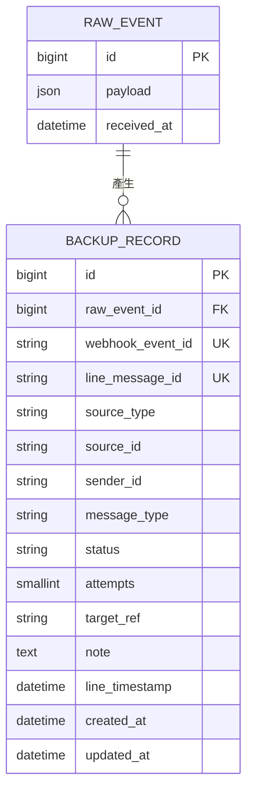

# Database

此系統用到兩張資料表：

- `RawEvent` — 存 LINE 送來的原始 Webhook 資料。
- `BackupRecord` — 每一則訊息的備份狀態，Worker 實際處理的對象。

## 設計原理

`RawEvent` 是原始資料的稽核副本，`BackupRecord` 是實際要處理、有狀態、可以重試的工作項目。分開存的話，就算 `BackupRecord` 處理壞了要重跑，原始資料還是完整保留著。

---

## ER Diagram

一個 `RawEvent`（一次 Webhook 請求，可能包含多個事件）會拆成好幾筆 `BackupRecord`。

---

## Table: RawEvent

**用途**：完整保存 LINE 送來的原始 Webhook 內容，之後除錯或需要重新處理時可以回頭查。

**欄位**

| 欄位 | 型別 | 必填 | 為什麼需要 |
|---|---|---|---|
| `id` | 自動編號 | 是 | 主鍵 |
| `payload` | JSON | 是 | LINE 送來的完整原始內容，不做任何加工 |
| `received_at` | 時間 | 是 | 記錄「這筆是什麼時候收到的」 |

**Index**：無。這張表只用來單筆查詢，不需要額外索引。

**Constraint**：無。原始資料先如實存下來，不做任何限制。

---

## Table: BackupRecord

**用途**：每一則 LINE 訊息對應一筆記錄，追蹤有沒有備份成功。

**欄位**

| 欄位 | 型別 | 必填 | 為什麼需要 |
|---|---|---|---|
| `id` | 自動編號 | 是 | 主鍵 |
| `raw_event_id` | 外鍵 → RawEvent | 是 | 知道這筆記錄是從哪個原始 Webhook 拆出來的 |
| `webhook_event_id` | 字串 | 是 | LINE 這次「送信」的 ID，用來擋掉「同一個 Webhook 被重送兩次」 |
| `line_message_id` | 字串 | 否 | LINE 訊息本身的 ID，用來擋掉「同一則訊息被存兩次」；非訊息事件（如使用者加入群組）沒有這個值 |
| `source_type` | 字串 | 是 | 這則訊息來自 1 對 1 / 群組 / 多人聊天室 |
| `source_id` | 字串 | 是 | 對話的 ID，用來決定 Google Drive 資料夾要放哪 |
| `sender_id` | 字串 | 否 | 傳訊息的人是誰 |
| `message_type` | 字串 | 是 | 決定要走 Notion 還是 Google Drive |
| `status` | 字串（四選一） | 是 | 記錄現在處理到哪個狀態 |
| `attempts` | 數字 | 是 | 已經重試幾次了 |
| `target_ref` | 字串 | 否 | 備份成功後，Notion 頁面 ID 或 Google Drive 檔案 ID |
| `note` | 文字 | 否 | 失敗原因或跳過原因，方便除錯 |
| `line_timestamp` | 時間 | 是 | 訊息原本的時間（不是收到 Webhook 的時間），用來排序、決定 Drive 資料夾 |
| `created_at` / `updated_at` | 時間 | 是 | 記錄建立/更新時間 |

**Index**

- `webhook_event_id`（唯一）— 擋重複送信
- `line_message_id`（唯一，允許多筆 NULL）— 擋重複訊息
- `status` — Worker 常常用 `WHERE status = 'PENDING'` 找待處理的記錄

**Constraint**

- `webhook_event_id` 不可重複、不可為空
- `line_message_id` 不可重複（可以是空值）
- `status` 只能是 `PENDING` / `SUCCESS` / `FAILED` / `SKIPPED` 其中一種
- `raw_event_id` 一定要指向一筆存在的 `RawEvent`

---

## 狀態說明 (Status)

| 狀態 | 意思 |
|---|---|
| `PENDING` | 等待處理 |
| `SUCCESS` | 已成功備份 |
| `FAILED` | 重試多次後仍失敗 |
| `SKIPPED` | 不符合備份條件（例如檔案太大、不支援的訊息類型），不算失敗 |

---

## Migration Strategy

- 資料表的每次改動都用 Django migration（`makemigrations` + `migrate`），不要手動改資料庫。
- Migration 檔案要跟程式一起 commit 進 Git。
- 本機與正式統一使用 PostgreSQL，同一套 migration、同一種 SQL 方言，不用再遷就兩種資料庫引擎的最小公約數。
- 部署新版本前，先跑 `migrate` 再讓新程式上線，避免程式跟資料庫schema對不上。

---

## Optional Notes（之後才需要考慮，現在不用做）

- 幫 `status` 加上資料庫層級的 `CHECK` 限制（目前只在程式層驗證就夠）。
- `note` 改成結構化的錯誤代碼表，而不是一個文字欄位。
- 幫 `(status, created_at)` 加複合索引（等資料量真的大了再加）。
- `RawEvent` 的保留/清除政策（多久之後可以刪除舊資料）。
- Migration 的 Expand-Contract 策略（正式資料量很大、不能停機時才需要）。
