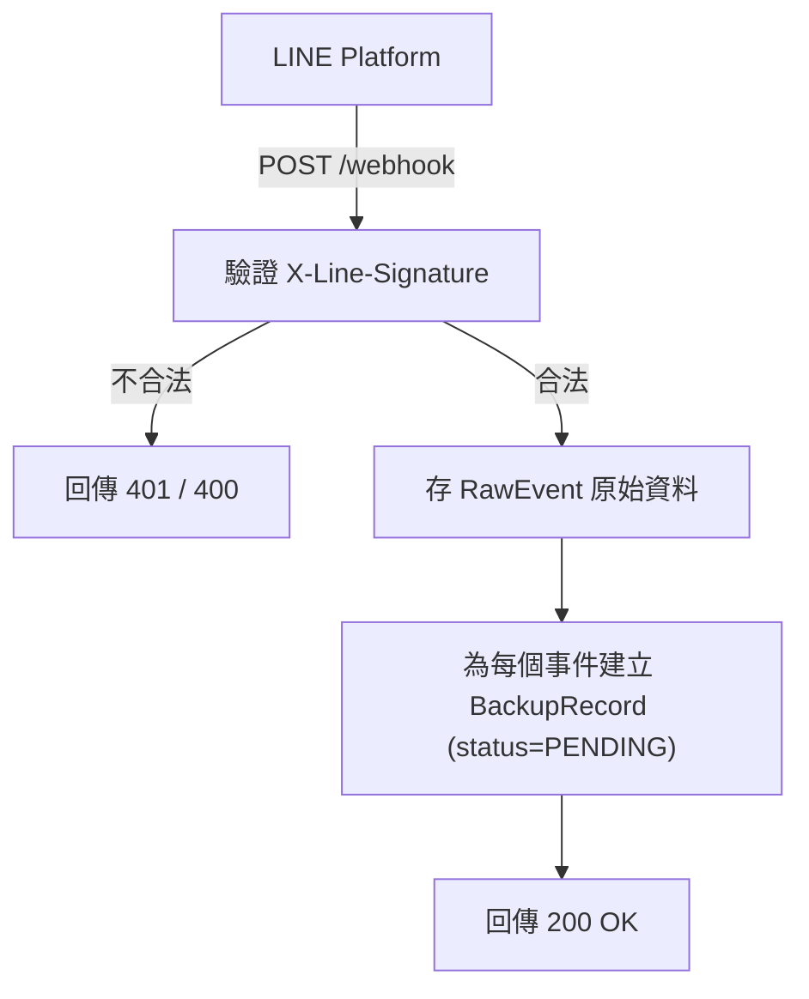
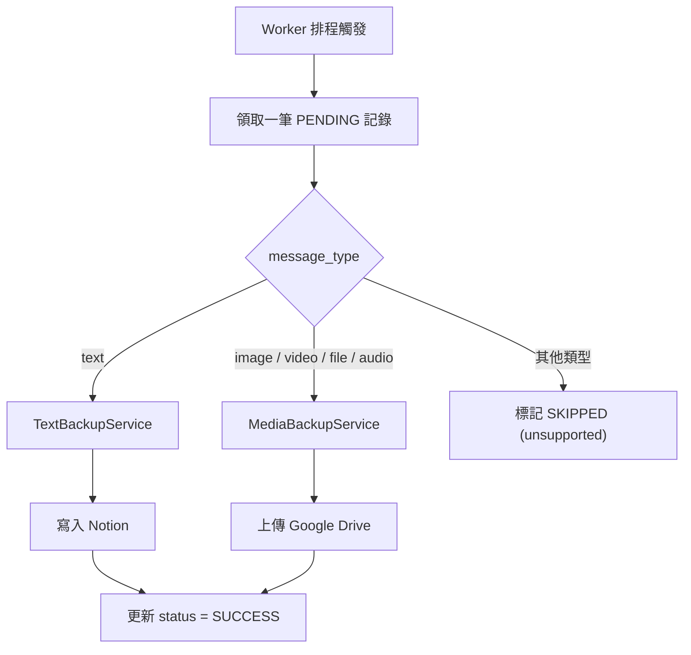
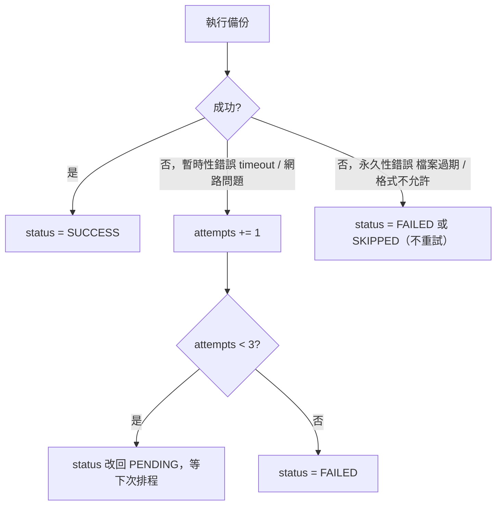
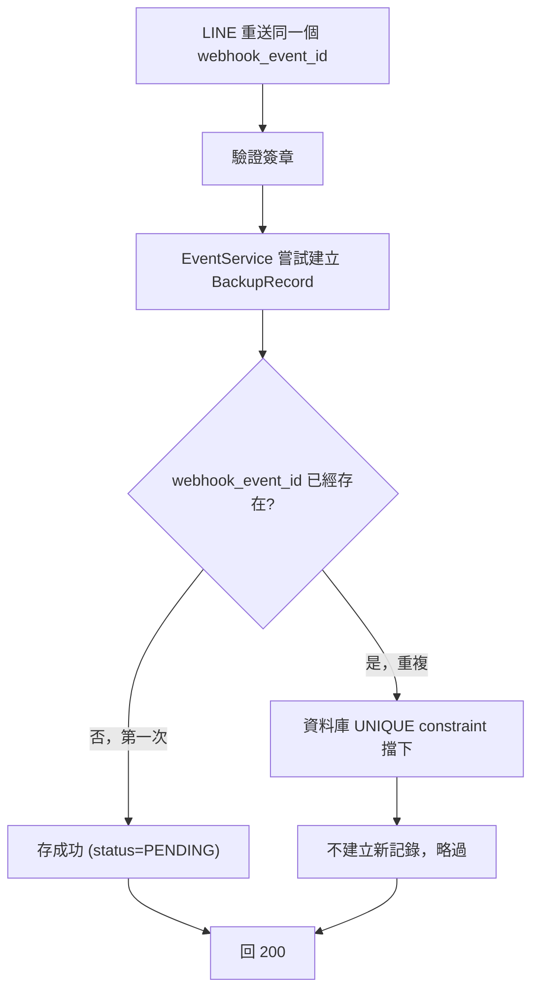
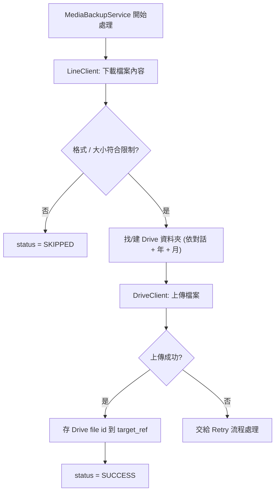
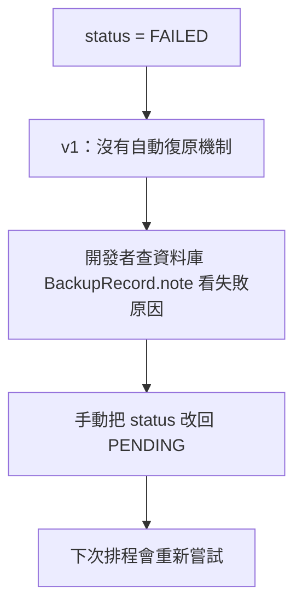

# Workflow

此文件說明系統裡 6 個主要流程的圖解版本，對應 [architecture.md](architecture.md) 的 Data Flow 和 [PRD.md](../PRD.md) 的 Use Case / Edge Case。

| 流程 | 一句話說明 |
|---|---|
| Webhook | 收到 LINE 事件、驗證、存檔、快速回應 |
| Backup | 依訊息類型分流到 Notion 或 Google Drive |
| Retry | 失敗後怎麼決定要不要重試 |
| Duplicate | 同一個事件被重送時怎麼擋掉 |
| Upload | 媒體檔案上傳 Google Drive 的細節 |
| Failure Recovery | 重試用完還是失敗時，現在怎麼處理 |

---

## 1. Webhook

LINE 送來事件之後，驗證、存檔、回應的過程。對應 [architecture.md](architecture.md) Flow 1。

LINE 要求 Webhook 要快速回應，所以這裡只做「驗證 + 存檔」，不做任何 Notion / Drive 的呼叫。如果存檔失敗（例如資料庫暫時掛掉），要回 `500` 讓 LINE 重送，不能回 `200` 假裝收到了。

---

## 2. Backup

背景 Worker 依訊息類型，把資料備份到 Notion 或 Google Drive。對應 [architecture.md](architecture.md) Flow 2。

用一個路由表（`BackupRouter`）判斷類型，而不是一長串 `if/elif`。之後要加新的訊息類型，只要加一條路由規則，不用改舊程式。

---

## 3. Retry

備份失敗之後，怎麼決定要不要重試。對應 [architecture.md](architecture.md) Flow 3、FR-7。

要分清楚「暫時性錯誤」跟「永久性錯誤」——網路斷線值得重試，但檔案已經過期，重試 100 次結果都一樣，浪費資源還會拖慢整個 Worker。

---

## 4. Duplicate

LINE 重送同一個事件時，系統怎麼擋掉重複備份。對應 UC-3、FR-8。

靠資料庫的 `UNIQUE` 限制擋，而不是程式先查「這筆存在嗎」再決定要不要存。因為兩個重複事件幾乎同時到達時，程式判斷會有 race condition（兩個都查到「不存在」，兩個都存進去），資料庫的限制不會。

---

## 5. Upload

`MediaBackupService` 把一個媒體檔案送進 Google Drive 的詳細步驟。對應 FR-6。

下載、驗證、上傳拆成三個獨立步驟，任何一步失敗都能清楚知道是哪裡出錯，也方便個別寫測試（例如單獨測「格式不符會被擋下」）。

---

## 6. Failure Recovery

一筆記錄重試 3 次還是失敗之後，目前怎麼處理。

v1 刻意不做自動復原（告警系統、自動重跑指令）——現在只有一個使用者、量不大，人工看一下資料庫就能處理。等真的需要，再做成 Optional Notes 裡列的功能。

---

## Optional Notes（之後才需要考慮，現在不用做）

- 自動失敗復原：Dead-letter queue + 告警通知（現在是人工查資料庫）。
- 提供一個管理指令，可以直接重跑指定的 `FAILED` 記錄，不用手動改資料庫。
- 針對「LINE 內容已過期」這類永久性錯誤，額外做通知讓使用者知道有訊息沒備份到。
